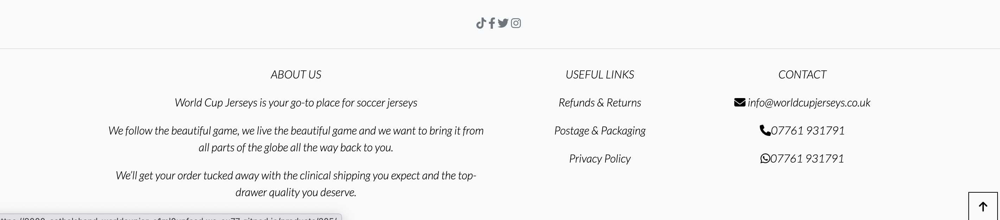
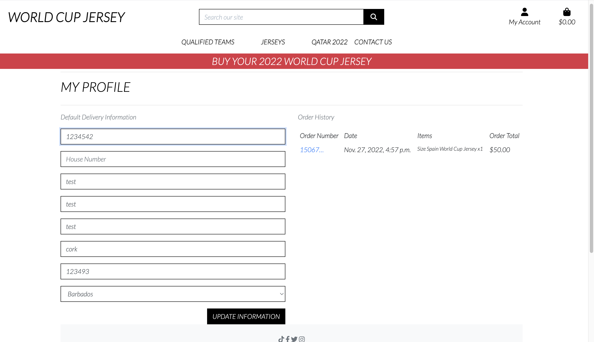
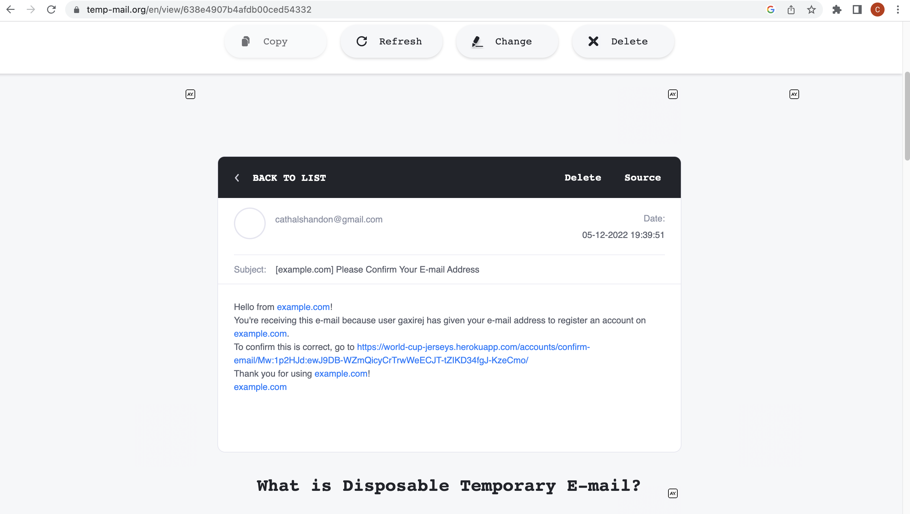

# World Cup Jerseys

WorldSoccerShop is your go-to place for soccer jerseys and we’re the one-stop-shop for followers of every team to find the best collection of jerseys and unique customizations from around the world.

The site is fully responsive and was built using the Django framework in Python.

The payment system used for the site is called Stripe. The system is set up in a 'dummy' mode and will not accept real card details.

World Cup Jersey is an e-commerce site offering various confections.

**View the live site [here](https://world-cup-jerseys.herokuapp.com/)**


# Table of Contents <a name="Home"></a>

1. [User Experience (UX)](#ux)<br>
    i.  [Strategy](#strategy)<br>
    ii. [Scope](#scope)<br>
    iii. [Structure](#Structure)<br>
    iv. [Skeleton and technical design](#skeleton)<br>
    v. [Surface](#surface)<br>
      
2. [Features](#features)<br>
    i. [Current Features](#features-existing)<br>
    ii. [Features to implement](#features-toimplement)<br>

3. [Marketing Strategy](#marketeing)<br>

4. [Qatar 2022](#qatar22)<br>

5. [Testing](#testing)<br>

    i. [User Stories/feature testing](#user-stories-testing)<br>
    ii.  [Automated testing](#automated-testing)<br>
    iii.  [Known issues during development and testing](#known-issues)<br>
    iv. [Validation testing  ](#validation-testing)<br>
    v. [Javascript testing](#js-testing)<br>
    vi. [Unfixed bugs](#unfixed-bugs)<br>
6. [Deployment](#deployment)<br>
7. [Technologies Used](#technology-used)<br>
8. [Credits](#credits)<br>
9. [Acknowledgements](#acknowledgements)<br>

# 1. User Experience (UX) <a name="ux"></a> 
### **Project goals:**
To create an online website that where user can login and buy jerseys.
- To enable users to edit profile and delivery info.
- To enable to navigate with ease with through the site.
- To ensure a safe environment in which to interact anonymously with secure account set-up.
- To ensure a responsive site accessible to all, across multiple devices.

### **Site owner goal:**
- To enable users to navigate with ease and read content.
- To have the ability to buy products and deactivate account users when necessary.
- To enable users to register their own accounts and manage passwords.
- A separate ‘site owner’ login to implement secure administration of the site.
- To ensure the site is fully responsive and accessible site for all users across multiple devices

### **User goals:**
- Users should find the platform intuitive and easy to use.
- To login/logout of the site
- Register for an account
- To post under a chosen ‘username’
- Users should be assured the data they provide whilst registering as an account user is going to be kept secure
- Generic aesthetically pleasing styling and colour palette to suit all users and accessibility 


## i. Strategy <a name="strategy"></a>

## User stories

1. As a **site user** I can **login with my username and password** so that **I can access the sites full functionality**

2. As a **logged-in site user** I can **log out of my account** so that **other users cannot access my account**

3. As a **site user** I can **register** so that **I have a role-based login and functionality of commenting and voting on posts**

4. As a **site user** I can **intuitively navigate the site** so that **the layout of the site is consistent**

5. As a **site user** I can **locate the social media accounts** so that **I can follow their updates**

6. As a **logged-in site user** I can **complete a purchase s** so that **I can get a product deliveried**

7. As a **logged-in site user** I can **add and delete** a **product**


## Website templates


## iv. Skeleton / Technical design <a name="skeleton"></a> 

Using the above as a guide, I have created a flow diagram to help me visualize how the user will navigate through the core functionality of the web store. During the Agile process, minor tweaks may occur to this pre-planned user journey, but the overall structure will remain the same.

Page 
--- | --- | ---
Structure | 


# 2. Features <a name="features"></a> 
## Existing features <a name="features-existing"></a>

### **Feature 1 Navigation bar**

Navigation bar is featured on all pages at the top of the screen<br>
This section will allow the user to easily navigate from page to page across all devices without having to revert back to the previous page via 'back button'<br>

The navbar collapses to a hamburger menu once the window width drops below 992px to ensure all information is displayed comfortably to the user.

* Search Bar

    The search bar is located in the middle of the navbar, above the links and can be used to search the site for products.

    The search term entered will be used to search the database for any products with matching information in either the product title, product description or product ingredients.

    On screens with a width below 992px, the search bar is hidden and can be displayed by clicking on the 'Search' button that is present in the navbar.

    

* Account

    A user icon is located in the top right of the page, allowing the user access to manage their account and personal information.


* Footer

    The top part of the footer is a full width div containing links to the Social Media pages for the business.

    The footer is displayed on all pages other than the main landing page of the website, and sits at the bottom of each page.

    The lower section of the footer is split into three columns with the first having a short About Us synopsis. The title of the column also links to the About Us page, but is not underlined due to the link also being available in the navbar.

    The middle column contains Useful Links which direct to individual pages for the Refunds & Returns Policy, Postage & Packaging Policy and Privacy Policy

    

* Landing Page

    Followed by the large hero photo of Kane, Ronaldo and Messi and a link to the jerseys for sale

    

* Registration Page

    The registration page is used by users to create a new account for the site.

    Form validation is used to ensure all fields on the form are completed. If this validation fails, a message is shown to the user and the form is not submitted.

    Once form validation has passed, the form will be submitted and the user will receive a confirmation email to verify their account.

*  Login Page

    The login page is used for users with an existing account to log in to the site.

    If the user has not verified their account by clicking on the link in the email they are sent, they will be unable to log in.

    A 'Forgot Password' link is present for users to recover their account in the event that they cannot remember the required information to log in.

* Logout page

    The logout page is used by users to log out if they are signed in, removing their session information.

    The user will be taken to a confirmation page upon clicking the 'Logout' link, to ensure this is the action they wish to take.


* Product List page

    The products page displays a list of available products in a search term or, if the correct option is selected, all products are shown.
    Each product card show an image of the product, the price (or price range), the category in which the product resides and the rating. 

    

* Product Detail page

    The product info section of the product details page shows all the important information related to each product.

    The left part of the product info section is taken up by an image of the product. The image can be enlarged upon clicking to enable a better view. This is done within the page using bootstrap, rather than opening a new tab.

    The name of the product is displayed at the top of this section and is also added to the title of the page.

    Edit and Delete buttons are shown next to the rating if the current user has superuser privileges, allowing the requested action to take place.

    

* Delivery Information

    The delivery information section shows any stored address information for the user.

    The information can be updated on this page, and these change will be used to autocomplete the delivery address when placing an order.

    The information displayed in this section can also be updated when the user completes the shop journey if they check the 'Save this delivery information to my profile' box.

* Create a Product page

    This page can be accessed by registered users who are logged in. Button link is located in the navbar for easy access to this page once logged in.
    There are messages to let users know which fields are required to create a post. Title field has to be a unique one, therefore there is a placeholder in the title field with a message ‘Your unique post title’ to advise you to create a unique title.
    Image upload is available but users can opt not to upload an image if they choose so.
    Once the create button is pressed, users will be directed to the post list page and a message to inform the user about the post is displayed below the navbar.

* Edit product page

    Edit post page is accessed by edit post button which is available in either product list or product detail page for users who are logged in. The button is visible for the user's own post only so that the post can only be edited by its own user or by superuser using the admin page.

    The required fields are identical to create post but all the entries of the post are retrieved so that users can edit only the field they wish to update.

    This page also contains a delete the post link which will display the page to confirm their intention to delete the post.

* Delete Product page

    When the user presses ‘Delete This Product’ link from the edit post page, this Delete Post page displays and asks the user for confirmation to delete the post. Users can either click the Confirm Delete button or cancel and go back to Posts.
    When the Confirm Delete button is pressed, the user will be redirected to the Product List page and 	a message will show below the navbar to inform that the post was deleted.

* Account

    A user icon is located in the top right of the page, allowing the user access to manage their account and personal information.
    Clicking on the icon displays a dropdown menu using Bootstrap's dropdown plugin with a number of options
            -Login & Register are displayed if the user is not logged in.
            -My Profile & Logout are displayed if the user is logged in.
            -Admin Dashboard & Add Product are displayed if the user is a superuser.


* Profile Detail page

    This page can be accessed by the View Profile button in the Members page or Post detail page if the user has their post displayed in the page.
    The page includes the image that the user posted and some brief description about them if they opted to enter any fields.
    Each user’s empty profile is created when they register to the site so every registered user has their own profile, but they can leave all the fields blank if they wish.

    

* Profile Edit page

    This page is displayed when the user clicks the button with their username which is located in the navigation bar.
    All the fields are optional so they can enter any field they wish to update and leave the rest as blank.
    Once the profile is updated, the user will be directed to the post list page and a message will be displayed to inform the user that their profile is updated.

 * About the Site page

    This page can be accessed from any page within the site from the link in the footer. 
    The page states which pages are accessible for users who are not logged in and what can registered and logged-in users can do on each page

* Register page

    This page can be opened from the register button in the navigation bar.
    New site visitors are simply asked to enter username, password and password confirmation to register for the use of this site. Email field can be left blank as it is optional.
    Once successfully registered, users will be redirected to the index page and have access to all the pages which are open for registered users.

* Login page

    Registered and returning users can use the login button to open the login page and supply their username and password to login.
    On successful login, users will be redirected to the index page with a message to inform them that they logged in successfully and they can choose any options provided in the page.

* Logout page

    Once a user is logged in, the Login button in the navigation bar will be replaced with the Logout button.
    Users can simply click this button to log out and confirm to sign out. This will display the home page with a message to inform that the user has successfully logged out.

* Cart

    A cart icon is also located in the top right corner of the page displaying the value of the current contents of the cart, and the number of items that are present in the cart.

    Clicking the cart icon will take the user to the cart page where they can complete their shopping journey.
    
    

* Checkout

    The Checkout page is split into two main columns: Customer Details & Order Summary. The Checkout app also features a Checkout Success page once the order has been submitted, and a loading overlay whilst the order is being submitted.

    The first section of this column asks for the customer to provide their name and email address. The name is required to ensure the correct delivery information is added to the package prior to it being dispatched, with the email address being used to send order confirmation to the customer. The customer is not required to sign in to complete their order, however if they are signed in, and have saved their delivery information, these fields will be populated.

    If the user is already registered, and has delivery information stored, this information will be automatically populated.

    The user also has the option to update or save their delivery information, which can be used to populate the form for future orders by ticking the checkbox below the form.

    The payment element of the checkout app is provided by Stripe. Stripe is used as a secure payment method, and means that no card information is stored within the website database, with all information being provided back to the website via Webhooks.

    

* Order Summary

    The order summary section shows a compacted version of the data displayed in the Cart app.

    The title of the Order Summary section shows the number of products contained within the cart.
    Each item within the cart is listed, including the size (if applicable) and quantity.
    Unlike the Cart app, in the Order Summary view only the Subtotal for each product is shown.
    As with the Cart app, the Order Total, Delivery charage and Grand Total values are shown to give the customer the opportunity to confirm everything looks correct before their order is submitted.

    

*  Checkout Success

    Once all of the previous steps have been completed, the payment_intent.succeeded response has been received and confirmation that the order has been created in the database, the user is taken to the Checkout Success page.

    Above the order summary itself, a message is shown advising the user that a confirmation email will be sent to them, confirming the details of their order.

    The user is then provided with the Order Number and Order Date, which can be used in the event the customer needs to contact the business, speeding up the process of retrieving the relevant order.

    The final section within the order summary box is the Billing Info section, providing a further recap of the Order Total, Deliverty charge and Grand Total of the order.

*  Contact Us

    The Contact Us page is linked to from various other places on the website and allows users to contact the business with any query they may have.

    The form was purposefully left as basic as possible to give maximum flexibility to the user. The form consists of 3 text fields (Email, Subject and Message.)

    Once all sections have been completed and the Submit button has been clicked, the information is stored in the database and the user is directed to the Contact Success page.

    The Contact Success page contains a message stating Thank for getting in touch with us. We've got your message, and we'll be in touch as soon as possible., with a button returning the user to the main products page.

    

* Toasts

    Toasts appear in the top-right corner on the screen when any information needs to be relayed to the user. The toasts appear using a CSS animation which alters the location of the toast.

    The toasts display messages under the categories of Success, Alert, Warning and Error.

    The toasts have slightly different designs depending on the type of toast used.

* Error 404 Page

    If the user navigates to a page that does not exist, the 404.html page will render. This page has the same basic layout as the home page of the site, but displays different text content. The button, however, still returns the user to the main products page.


* Error 500 Page

    If the user navigates to a page that causes a response the server does not know how to handle, the 500.html page will render. This page has the same basic layout as the home page of the site, but displays different text content. The button, however, still returns the user to the main products page.


# 3. Testing <a name="testing"></a> 

### Responsiveness 

Throughout the site is tested to ensure all pages are displayed appropriately in all screen sizes.

## Testing User Stories

### 1. As a Site Admin I can create, read, update and delete products so that I can manage the site content

* An admin site has been provided so that the Site Admin can manage products.

* Products can be created, read, updated and deleted from the site.

* Products main fields are being displayed for the Site Admin to identify them easily.

* Products can be filtered and searched to narrow down a specific group.

### 2. As a logged-in site user I can log out of my account so that other users cannot access my account.

* Registered Site Users are give the option of logging out of website.

* Registered Site Users are able to click on logout button which will be show another page.

* Registered Site Users the are given the choice to click if they are sure they want to logout.

* Registered Site Users are not able to gain any access of any other user account.


### 3.As a site user I can intuitively navigate the site so that the layout of the site is consistent.

* The site is easy to naviagte and easy to use across all devices.

### 4.As a site user I can locate the social media accounts so that I can follow their updates.

* The links facebook, twitter all allow users to click on and follow the creators more on social media

 

## Code Validation

### HTML

The [W3C Markup Validator](https://validator.w3.org/) service was used to validate the HTML code of the project in order to ensure there were no syntax errors.


### CSS

[W3C CSS Validator](https://jigsaw.w3.org/css-validator/) service was used to validate the CSS code of the project in order to ensure there were no syntax errors. 

W3C CSS Validator found no errors or warnings on my CSS.


### Javascript 
Checking my JS files with jshint


### Lighthouse 
Checking lighthouse 


## Accessibility


## Manual Testing

## Manual testing on each page.

Along with testing user stories manually, each page has been manually tested to ensure that the links and the contents are properly placed and functioning, and that all data entry is appropriately handled as expected. Page access is also tested for the restricted pages.

Every link within the page has been checked to ensure that it displays the page appropriately.
Visual inspections carried out to ensure that restricted page links or buttons are not visible on the page.

#### Landing page

**Users who have not logged in**  
 They are presented with Login and Register buttons to the right of the navigation bar. Visual inspections are carried out to ensure that the buttons are displaying appropriately to logged in users and users who are not logged in a number of times.

**Registered and logged in users**

 On the opening page, they can click on Login to open the Login page. After successful login, manual testing took place to ensure that the message of successful login is displayed and Register and Login buttons are replaced by three buttons which are, 'Product management', 'My profile' and 'Logout'.
 Each button and link is manually tested to ensure it opens the appropriate page 

 #### Product List page

**For site visitor who has not logged in**

Visual inspections are carried out so that no links to the product detail page or edit product are present in each post in the list. 
Ensure that all the posts displayed in the page are approved posts and information displayed is correct as created post

**For registered and logged in users**

Ensure the post list is only displaying approved posts with correct information entered by the user.
A View button is present in each post and links will open the selected post detail page.
For a currently logged in user’s own post, an Edit button is present in the post panel and selecting it will open the ‘Edit’ post page with selected post entry retrieved.

#### Product Detail page

**For a site visitor who has not logged in**

Access is attempted by copying the individual post address to ensure that the page is not displayed for the site visitors who are not logged in.

**For registered and logged in users**

Visually inspected all post entries are correctly retrieved and displayed in the post.
A View Profile button opens the selected users profile page.

#### Create a Product page

**For site visitor who has not logged in**

Access is attempted by copying the page address to ensure that the page is not displayed for the site visitors who are not logged in.

**For superusers**

Entering an existing title field will return the error message to prompt the user to enter another title.
Attempting to create a post with a blank required field returns an error message.
File upload is successful without any issue.
When ‘Create button’ is pressed and entry is successful, the page will redirect to ‘product list page’ with a message to notify the user about the status of the post

#### Edit product page

**For site visitor who has not logged in**
Access is attempted by copying the page address to ensure that the page is not displayed for the site visitors who are not logged in.

**For superusers**

Displayed edit post page has corresponding selected post entries in each field.
Removing the required fields does not let a user to update the post.
An Error message is used to inform users if a required field is left blank or an attempt to update is not showing at the moment.
Upon successful update,  the page redirects to the post list page with a message to inform the users the update was successful.
Delete this post link opens Delete post page

#### Delete Product page

**For site visitor who has not logged in**

Access is attempted by copying the page address to ensure that the page is not displayed for the site visitors who are not logged in. 

**For superusers**
Cancel and go back to post link opens the post list.
Pressing Confirm Delete button actually deletes the selected post and associated comments and then returns post list page with message to notify the user the post is deleted


#### View profile page

**For site visitor who has not logged in**

Access is attempted by copying the page address to ensure that the page is not displayed for the site visitors who are not logged in.

**For registered and logged in users**

A user’s profile page displays when selected.

#### Profile Edit page

**For site visitor who has not logged in**

Access is attempted by copying the page address to ensure that the page is not displayed for the site visitors who are not logged in.

**For registered and logged in users**
On pressing their 'username' button in the navigation bar, their own profile page opens for editing.
Upload the image works without any issues.
As all the fields are optional there is no error message present.
Successful update will redirect to 'Post list' page with a notification message 


#### Register page

Tested all validation works without any issues.
Ensure that an existing username cannot be registered and returns the error.
Password validations are in place.
Upon successful registration, the user is redirected to landing page with a notification for their login

#### Login page

Various usernames are used for login attempt and to ensure the login process meets the standard.
Upon successful login, the user is redirected to landing page with a notification for their login

#### Logout page
Ensure logout will redirect to the landing page with a notification for their logout and restricted pages cannot be accessed.


# 4. Marketing Strategy <a name="marketing"></a> 

- ### FaceBook page


- ### Email page

- The thank you for subscribing email that is being sent from gmail to users who submits their email address looks like this:




- ### Robots.txt page

- Robots.txt is a text file webmasters create to instruct web robots (typically search engine robots) how to crawl pages on their websites. The robots.txt file is part of the robots exclusion protocol (REP), a group of web standards that regulate how robots crawl the web, access, and index content, and serve that content up to users.

- ### Sitemap.xml page

- An XML sitemap is a file that lists a website’s essential pages, making sure Google can find and crawl them all. It also helps search engines understand your website structure. You want Google to crawl every important page of your website. But sometimes, pages end up without internal links pointing to them, making them hard to find. A sitemap can help speed up content discovery.

- ### Privacy Policy page

- A privacy policy page helps visitors trust the website.Its good to have a privacy policy page if you're collecting any form of personal information including: Names. Email addresses

# 5. Qatar 2022<a name="qatar"></a> 

- It is safe to say no World Cup has generated as much debate and controversy before a ball is kicked as the finals in Qatar, thats why I choose a page to show the problems with holding the world cup in this country. I used very little styling on this page as I wanted to get the points to stand out.


# 6. Deployment <a name="deployment"></a> 

- ### Github

  - Before you start, a repository (repo) is required on Github which can be created in a number of ways.

    - #### Create A New Repo

      1. Log into Github.
      2. In the top left corner of the page is a column titled 'Recent
         Repositories' Click the button labelled 'New'.
      3. Name the repository and click 'Create repository'.
      4. Your new repository is now set up and ready to use.

    - #### Forking

      Creating a forked repo creates a copy of a repo within
      github account.

      How to Fork A Repository:

      1. Sign in to Github and go to the required repo.
      2. Locate the Fork button at the top right of the page.
      3. Click the button then click 'Create Fork'.
      4. You have now successfully forked the repo.

    - #### Clone

      Cloning a repo creates a copy of a repo on your
      local machine.

      How to Clone A Repository;

      1. Sign in to Github and go to the required repo.
      2. At the top of the page, above the files, is a button labelled
         'Code'
      3. Select the required option from HTTPS, SSH or Github CLI, then click the clipboard icon to copy the URL.
      4. Open git bash
      5. Type 'git clone' and then paste the copied URL. Press Enter.

- ### Django

  This project is built on the Django framework.

  Django can be installed by following the steps below:

  1. In your chosen IDE type the command:  
     `pip3 install django`
  2. To create an name your project use the command:  
     `django-admin startproject <your_project_name> .`
  3. A gitignore file is an important addition as you can specify
     which files should not be uploaded to the Github repo, such as
     database credentials.

     A gitignore file can be created in the CLI using the command:

     `touch .gitignore`

     The .gitignore file for this project can be found [here](.gitignore)

  4. To check django has been installed and your project created successfully, type the following command:

     `python3 manage.py runserver`

     Following the link provided in the CLI should display the Django landing page.

  5. Next, initial database migrations need to be completed. This can be achieved with the command:

     `python3 manage.py migrate`

     You can see the changes to be made without executing them with the command:

     `python3 manage.py migrate --plan`

  6. In order to have access to the admin panel, a superuser is required. This is created with the command:

     `python3 manage.py createsuperuser`

     This will then ask you to create a username and password with an optional email address.

  7. Once these steps are completed you can push your changes to Github using the commands below in order, or with the interface in your chosen IDE:

     ```
     git add .
     git commit -m "initial commit"
     git push
     ```

[Back to top ⇧](#nibble-kitchen)

### Heroku

Heroku is the chosen cloud platform for the project, allowing the project to be built and deployed via a link to the Github Repo.

1. Once you are logged in to Heroku, click the 'New' button in the top right corner of the page and select 'Create new app'.
2. Select a name for your app (which must be unique!), select the closest region to you and click 'Create App'.
3. Once the app has been created, select the resources tab, navigate to the 'Add-ons' section and search for 'Heroku Postgres'.
4. Select 'Heroku Postgres', then under 'Plan name' choose 'Hobby Dev - Free' and click 'Submit Order Form'.

To use Postgres with Django, additional tools are required, and can be installed via the CLI in your chose IDE.

1.  In your CLI type the command:  
    `pip3 install dj_database_url`
2.  Once completed, enter the following command into the CLI:  
    `pip3 install psycopg2-binary`
3.  At the top of the settings.py file in your main project folder, and the line:
    ```
    import dj_database_url
    ```
4.  Scroll down in settings.py to the `DATABASES` section. Replace the code in this section with the code below.

    ```
    DATABASES = {
        'default': dj_database_url.parse(<DATABASE_URL_GOES_HERE>)
    }
    ```

    The Postgres Database URL can be found in the settings tab of your app in Heroku, under the Config Vars section.

5.  As we are now connected to a new database, we need to repeat the previous migration steps. This is done by running the command:  
    `python3 manage.py migrate`

6.  We also need to create a new superuser with the command :  
    `python3 manage.py createsuperuser`

7.  Before we commit these changes, we will need to alter the `DATABASES` section in settings.py to prevent the Postgres Database URL ending up in version control.

8.  This can be achieved by replacing the existing content of the `DATABASES` section with the code below.

    ```
    if 'DATABASE_URL' in os.environ:
        DATABASES = {
            'default': dj_database_url.parse(os.environ.get('DATABASE_URL'))
        }
    else:
        DATABASES = {
            'default': {
                'ENGINE': 'django.db.backends.sqlite3',
                'NAME': BASE_DIR / 'db.sqlite3',
            }
    }
    ```

9.  Gunicorn needs to be installed next, which acts as our web server. This is done with the command:

    `pip3 install gunicorn`

10. We also need to create a `Procfile` to tell Heroku to create a web dyno. In the root directory of your app, create a file named `Procfile` and inside insert the code:

    `web: gunicorn PROJECT_NAME_HERE.wsgi:application`

11. In Heroku, we need to prevent the collection of static files until we have set up AWS. This is achieved by navigating to the Settings tab in Heroku, selecting the Config_Vars section and entering `DISABLE_COLLECTSTATIC` in the `KEY` field, and `1` in the `VALUE` field and clicking the 'Add' button.

    When the site is deployed at this stage, no static files will be present, but this will be rectified later.

12. In order to allow your project to be viewed when deployed to Heroku, we need to add the Project URL to the `ALLOWED_HOSTS` section of settings.py
    ```
    ALLOWED_HOSTS = ['PROJECT_NAME_HERE.herokuapp.com', 'localhost', '127.0.0.1']
    ```
13. The changes can now be committed and pushed to Github. Once this has been done, we can push the changes to Heroku with the command:

        `git push heroku main'


### Stripe

Stripe is used to handle the checkout process when a payment is made. A Stripe account is needed. You can sign up [here](https://stripe.com/en-gb).

#### Payments

1. To set up Stripe payments you can follow the guide available [here](https://stripe.com/docs/payments/accept-a-payment#web-collect-card-details).

#### Webhooks

1. To set up a webhook, sign into your Stripe account and click `Developers` located in the top right of the navbar.
2. In the side bar on the left of the page, click `Webhooks`, then `Add endpoint` on the right side of the page.
3. Enter your Heroku project name, checkout app name, followed by wh into the `Endpoint URL` field. It should look something like this:
   ```
   https://your-app-name.herokuapp.com/checkout/wh/
   ```
4. Click `+ Select events` and check `Select all events` at the top of the page. Click `Add events` at the bottom of the page, followed by `Add endpoint` on the next page.
5. The webhook has now been created and should have generated a secret key. We will need this to add to the Heroku Config Vars.
6. Open your app on Heroku and navigate to the `Config Vars` section under the `Settings` tab. You will need the secret key just generated for your webhook, in addition to your Publishable key and secret key that you can find on the [Stripe API keys page](https://dashboard.stripe.com/test/apikeys).
7. Add these values and key pairs to the Config Vars:
   ```
   STRIPE_PUBLIC_KEY = 'insert your stripe publishable key'
   STRIPE_SECRET_KEY = 'insert your secret key'
   STRIPE_WH_SECRET = 'insert your webhooks secret key'
   ```
8. In setting.py in your Django project, insert the following near the bottom of the file:
   ```
   STRIPE_PUBLIC_KEY = os.getenv('STRIPE_PUBLIC_KEY', '')
   STRIPE_SECRET_KEY = os.getenv('STRIPE_SECRET_KEY', '')
   STRIPE_WH_SECRET = os.getenv('STRIPE_WH_SECRET', '')


# 7. Technologies Used <a name="technology-used"></a>  <a name="Home"></a>
## Languages

  * [Bootstrap](https://getbootstrap.com/)
  * [CSS](https://en.wikipedia.org/wiki/CSS)
  * [Django](https://www.djangoproject.com/)
  * [HTML5](https://en.wikipedia.org/wiki/HTML5)
  * [Javascript](https://en.wikipedia.org/wiki/JavaScript)
  * [JQuery](https://en.wikipedia.org/wiki/JQuery)
  * [Python](<https://en.wikipedia.org/wiki/Python_(programming_language)>)

### Libraries and Frameworks

*  [AllAuth](https://www.intenct.nl/projects/django-allauth/) - Django app used for local authentication.
  * [Am I Responsive](http://ami.responsivedesign.is/) - Used to verify responsiveness of website on different devices.
  * [Balsamiq](https://balsamiq.com/) - Used to generate Wireframe images.
  * [Browser Stack](https://www.browserstack.com/) - Used for Cross Site Browser Testing.
  * [Chrome Dev Tools](https://developer.chrome.com/docs/devtools/) - Used for overall development and tweaking, including testing responsiveness and performance.
  * [Django Crispy Forms](https://django-crispy-forms.readthedocs.io/en/latest/) - Django app to allow control over rendering behaviour of django forms.
  * [Django Quill Editor](https://github.com/LeeHanYeong/django-quill-editor) - WYSIWYG editor added for easy updating of text only content on the site.
  * [Favicon.io](https://favicon.io) - Used to generate Favicon image.
  * [Flake8](https://github.com/pycqa/flake8) - Linter used to check style and quality of code.
  * [Flake8 HTML](https://pypi.org/project/flake8-html/) - Tool to output Flake8 test report.
  * [Font Awesome](https://fontawesome.com/) - Used for icons on multiple pages.
  * [GitHub](https://github.com/) - Used for version control.
  * [Gunicorn](https://gunicorn.org/) - Python WSGI HTTP Server
  * [Heroku](https://heroku.com) - Used for deployment and hosting of the project.
  * [JQuery](https://en.wikipedia.org/wiki/JQuery) - Used to simplify definition of DOM elements, but used minimally with a preference for vanilla Javascript.
  * [JSHint](https://jshint.com/about/) - Linter used to flag errors, bugs and warnings in Javascript code.
  * [Pillow](https://pypi.org/project/Pillow/) - Python Imaging Library to add image processing capabilities to the project.
  * [Prettier](https://marketplace.visualstudio.com/items?itemName=esbenp.prettier-vscode) - Used for consistent code formatting.
  * [Slack](https://slack.com/) - Used for support and advice from the Code Insitute Community.
  * [Sorted M2M Filter Horizontal Widget](https://pypi.org/project/django-sortedm2m-filter-horizontal-widget/) - Django admin widget to allow horizontal sorting of products and ingredients.
  * [Stripe](https://stripe.com/) - Payment Processing Platform used to handle card details in the checkout app.
  * [Visual Studio Code](https://code.visualstudio.com/) - Application used for development of this site.
  * [W3C](https://www.w3.org/) - Used for HTML & CSS Validation.
  * [WAVE](https://wave.webaim.org/) - Used for Accessibility evaluation.
  * [Woosmap](https://www.woosmap.com/) - Provided address searching API for checkout app.


#


# 8. Credits <a name="credits"></a>
See below list of tutorials and documentation i used throughout this project
- The basic skelton setup for this project was based on  “I think therefore I blog project by the Code Institute 
- I used and adapted code for the navbar , emails and search Boutique Ado project by the Code Institute


# 9. Acknowledgements <a name="acknowledgements"></a>
I would like to thank Code Institute and its amazing Slack community for their support and providing me with the necessary knowledge to complete this project.
I would also like to thank my tutor Marcel for his invaluable support, feedback and guidance through the whole process.